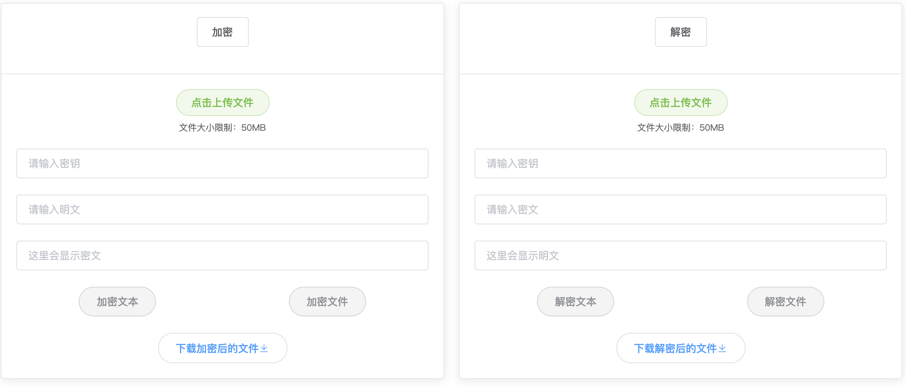

## 基于Springboot+Vue实现的DES算法

### 项目介绍

该程序可实现任意文本和文件的DES加密和解密，实现原理是先将待加密的文本或文件转换为字节流并以字节数组的形式存入内存，再对字节数组进行DES变换得到新的字节数组，进而得到加密后的文本或文件，解密操作则与之相反。

### 项目技术栈

* 前端：Vue.js, Element UI
* 后端：Spring, SpringBoot, SpringMVC

### 使用命令行的方式运行该项目

在项目主目录下依次使用以下命令

#### 编译源码

```ba
mvn compile
```

#### 启动项目

```ba
mvn spring-boot:run
```

### 用户界面展示



